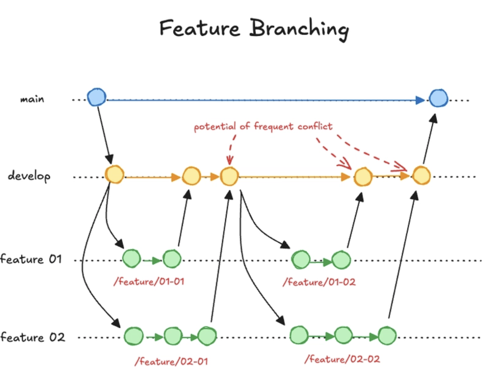

# Branching strategy

The detailed rules live in [Docs/conventions_contract/](../conventions_contract): branching, pull requests,
releases and versioning. This document explains what we chose, why, and what we learned.

## 1. What version control strategy did we choose, and how did we do and enforce it?

We use **feature branching** with a long-lived integration branch:

```
feature branch  ->  dev (PR + review + CI)  ->  main (release PR + CI, version bump)
```



- **`main`** holds released, deployable code. Every merge to `main` is deployed to the Azure VM and tagged.
- **`dev`** is the integration branch. All work reaches it through a pull request.
- **Feature branches** are named `<type>/<issue-number>-<slug>` (e.g. `feature/42-add-search-endpoint`), always
  branch off `dev`, and trace to one GitHub issue.
- **Releases** are a PR from `dev` into `main`, titled `release: vX.Y.Z`.
- **Versioning** follows [Semantic Versioning](https://semver.org): `MAJOR.MINOR.PATCH`. Patch for backward
  compatible bug fixes, minor for backward compatible new functionality, major for incompatible API changes. We
  stay on `0.x` until the Go rewrite matches the original Flask app.

### Enforcement

The rules are enforced by GitHub rulesets with no bypass actors, so they apply to everyone including admins:

| Rule | `dev` | `main` |
| --- | --- | --- |
| Branch cannot be deleted or force-pushed | yes | yes |
| Pull request required | yes | yes (via required checks) |
| Approving review required | 1 (never your own PR) | no |
| Merge method | squash only (enforced) | merge commit (convention, not enforced) |
| Required checks: *Build, vet and test*, *golangci-lint* | yes | yes |
| Required check: *Release PR* | no | yes |

The *Release PR* check ([release-check.yaml](../../.github/workflows/release-check.yaml)) blocks any PR into
`main` that does not come from `dev`, is not titled exactly `release: vX.Y.Z`, or does not raise the version
above the latest tag. After a merge to `main`, the [deploy workflow](../../.github/workflows/deploy.yaml)
deploys and then tags and publishes a GitHub Release from the PR title.

Review is required only on `dev`. A second review on the `dev` to `main` PR was dropped because it made releases
too slow, and everything in a release has already been reviewed.

## 2. Why did we choose it, and why not the others?

We are a new group and did not know each other's work or habits when we started. The most important thing to us
was that **nothing breaking reaches deployment**. Feature branching gives us that: work is reviewed and checked in
`dev` first, and `main` only receives a state that has already been integrated and passed CI. It is also simple
to explain and follow, which matters in a group where everyone is still learning the tooling.

The other strategies from the course, and why we did not pick them:

- **Trunk-based development** (everyone merges to the trunk multiple times a day). It is the fastest, but it
  relies on strong automated tests and mutual trust, and every merge reaches deployment. We are new to each
  other's work and our test coverage is still growing, so there would be no buffer between a mistake and
  production.
- **GitHub Flow** (short-lived branches and pull requests straight into `main`, deploy on merge). It is close
  to what we do, and we use the same PR review. The difference is that we merge into `dev` first and only
  release to `main` as a deliberate step. That extra step is what keeps unreleased, possibly unstable work
  away from deployment, at the cost of speed.
- **Gitflow** (`main`, `develop`, `feature`, `release` and `hotfix` branches). We effectively use a slimmed-down
  version of it: `dev` is our `develop`, and a release PR from `dev` to `main` is our release step. We left out
  the long-lived `release/*` and `hotfix/*` branches, because they add merge rules and overhead that a small
  team with one deployed version does not need. A fix goes through the same path as a feature.
- **Release branching** (a branch for each release). It is useful when several released versions must be
  maintained and patched in parallel. We run a single version on a single VM, so there is nothing to back-port
  and the branches would only add work.

### Merge vs. rebase

We merge and do not rebase shared history:

- Feature branches are **squash-merged** into `dev`, so one issue becomes one commit and `dev` stays readable.
  This is enforced by the ruleset.
- Release PRs from `dev` to `main` use a **merge commit**, so the release boundary stays visible in history.
- Before opening a PR we **merge `dev` into our branch** rather than rebasing. Rebasing rewrites history, which
  is easy to get wrong for a group still learning git, and force-pushing is not allowed on `dev` and `main`.
  Merging is safer, at the cost of some extra merge commits on feature branches, which the squash removes
  anyway.

## 3. What advantages and disadvantages did we run into during the course?

### Advantages

- **Stability.** `main` is always deployable. Breaking changes are caught in review or CI on `dev`, not in
  production.
- **Shared understanding.** Reviews on every PR meant we saw each other's code, which helped as a new group.
- **Traceability.** One issue is one branch, one squashed commit on `dev`, and one line in the release notes.
- **Safe, repeatable releases.** The release PR check and automatic tagging remove manual steps and mistakes
  such as wrong version numbers.

### Disadvantages

- **Slow delivery.** A feature has to go through a PR, a review by someone else, and then wait for the next
  release before it is deployed. Features and bug fixes reach users slowly, and this is the main cost of the
  strategy.
- **Releases slipped.** We intend to release to `main` at least once a week but have not always done so, which
  makes the delay above worse and makes each release bigger and harder to trace.
- **Review as a bottleneck.** GitHub does not allow approving your own PR, so every change waits for someone
  else. Requiring a second review on `main` as well was too slow, so we dropped it.
- **Merge conflicts on `dev`.** Several features change shared files in parallel, and conflicts surface late.
  We merge `dev` into our branch before opening a PR to reduce this.
- **Process was not enforced from day one.** Early PRs (#27, #29, #30) reached `dev` with no review and no
  checks. We added the rulesets afterwards.
- **Release PR freeze.** We should not merge into `dev` while a release PR is open, which briefly blocks work.
- **Stale branches.** Merged branches are not yet deleted automatically, so old branches pile up in the
  repository.

## 4. Revisions and improvements (updated during the course)

| Change | Status |
| --- | --- |
| Drop the approving review on the `dev` to `main` release PR (too slow with review on both branches) | Done |
| Automatically delete branches after merge (GitHub "Automatically delete head branches" setting) | Planned |
| Release to `main` at least once a week | Intended, not always met |
| Clean up the existing stale branches | Planned |

This document is revised as we learn more during the course.
